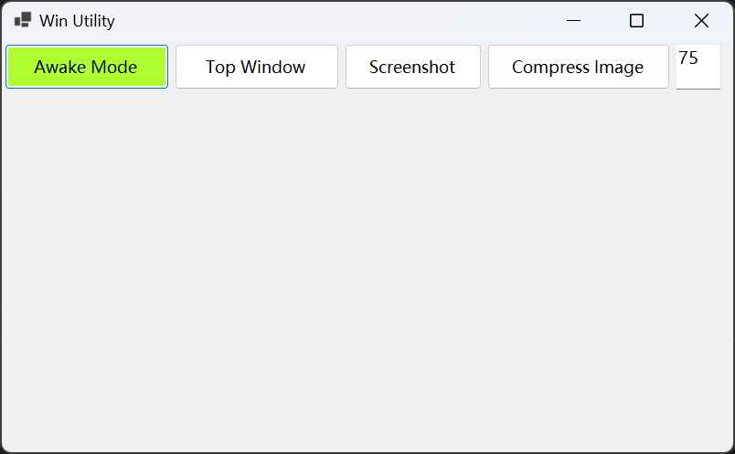

# Profile

Windows Utility Application

## QuickStart

## Features

### Prevent Sleep Mode

Keeps the laptop from entering sleep mode while the application is running.

* Click the button to active

### Topmost Window

Ensures that the application window stays on top of all other windows.

* Click the button to active
* Ctrl + Shift + Alt + T

### Region Screenshot

Allows users to capture screenshots of specific areas of the screen.

* Click the button to active
* Select the region
* Save to desktop

### Compress Image

Enables you to reduce the file size of images while maintaining lossless quality, ensuring that your images are optimized for storage without compromising their clarity.

* Input quality in TextBox
* Click the button to active
* Select images
* Save to source path with file name suffix of 'HHmmss'

## Suggestions and Future Development

We are continuously working to improve this application. If you have any suggestions for new features or improvements, please let us know! We will consider incorporating your ideas into future updates.
